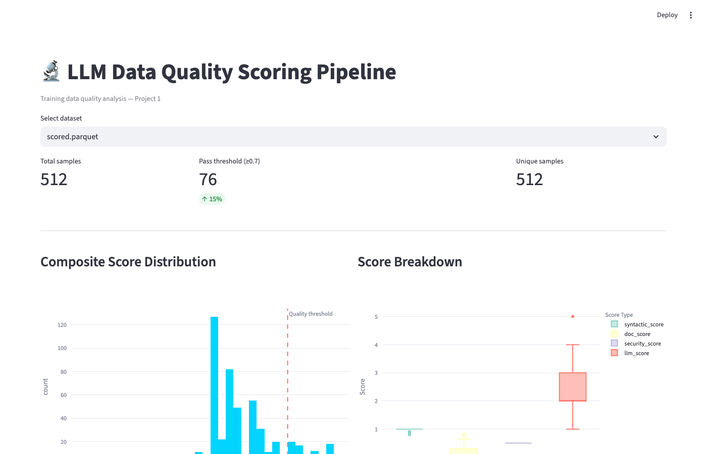

# LLM Data Quality Scoring Pipeline

A multi-stage data pipeline that ingests publicly available code datasets, applies quality scoring across four dimensions, and outputs training-ready JSONL data with a quality dashboard.

Built as a portfolio project to demonstrate LLM training data operations — directly relevant to roles involving data strategy, pipeline design, and quality control for AI training data.



---

## Why This Project

High-quality training data is one of the most critical — and least discussed — factors in LLM performance. This pipeline explores what "quality" means for code training data and operationalises it into a repeatable, scored, auditable process.

The design mirrors real-world LLM data operations:
- **Provenance tracking** — every sample knows its source, version, and score
- **Quality as a spectrum** — samples are not simply pass/fail; they carry a composite score
- **Human + AI hybrid scoring** — rule-based signals combined with LLM evaluation (RLAIF in miniature)
- **Documentation first** — a Data Card ships with the dataset

---

## Pipeline Architecture

```
Raw Sources          Transform            Quality Scoring            Output
─────────────        ─────────────        ───────────────            ──────
The Stack v1    →    Deduplication   →    Syntactic (35%)       →    JSONL
CodeSearchNet   →    AST Validation  →    Documentation (25%)   →    Parquet
HumanEval       →    Schema Norm.    →    Security (20%)        →    Dashboard
                                         LLM Score (20%)            Data Card
```

---

## Quick Start

```bash
# 1. Clone and install
git clone https://github.com/whitet-96/llm-dq-scoring.git
cd llm-dq-scoring
pip install -r requirements.txt

# 2. Configure environment
# Create a .env file with your credentials:
#   ANTHROPIC_API_KEY=your_key_here
#   HF_TOKEN=your_huggingface_token_here

# 3. Run pipeline (start small)
python main.py --stage all --sample 1000 --language python

# 4. View dashboard
streamlit run dashboard/app.py
```

---

## Project Structure

```
llm-dq-scoring/
├── main.py                  # Pipeline entrypoint
├── config.py                # Thresholds, weights, paths
├── ingestion/
│   └── ingest.py            # HuggingFace dataset streaming
├── transform/
│   └── clean.py             # Dedup, AST validation, schema normalisation
├── scoring/
│   └── score.py             # Quality scoring (syntactic, doc, security, LLM)
├── dashboard/
│   └── app.py               # Streamlit quality dashboard
├── docs/
│   ├── DATA_CARD.md         # Dataset documentation
│   └── dashboard_preview.png
├── data/
│   ├── raw/                 # Ingested parquet files (gitignored)
│   ├── processed/           # Cleaned parquet files (gitignored)
│   └── scored/              # Final scored JSONL + parquet (gitignored)
├── tests/
│   ├── test_scoring.py
│   └── test_transform.py
├── requirements.txt
└── README.md
```

---

## Scoring Methodology

| Dimension | Weight | Method |
|---|---|---|
| Syntactic | 35% | AST validity, line length, alphanum ratio |
| Documentation | 25% | Docstring presence, comment ratio |
| Security | 20% | Bandit static analysis flags |
| LLM (sampled) | 20% | Claude API rating on 500-sample subset |

The ~15% pass rate at the 0.70 threshold is intentional. Real-world code datasets contain a high proportion of low-signal files — boilerplate, auto-generated code, minimal scripts — so a selective threshold produces a higher-quality training subset. All samples are retained in the output with their full score breakdown, making the threshold a downstream decision rather than a hard filter in the pipeline. The default threshold is set in `config.py` (`QUALITY_THRESHOLD = 0.70`) and can be adjusted without re-running scoring.

See [Data Card](docs/DATA_CARD.md) for full methodology and known limitations.

---

## Output Format

Each line of the output JSONL:

```json
{
  "id": "the-stack_python_000042",
  "source": "the-stack",
  "language": "python",
  "content": "def add(a, b):\n    \"\"\"Add two numbers.\"\"\"\n    return a + b",
  "syntactic_score": 0.91,
  "doc_score": 0.75,
  "security_score": 1.0,
  "security_flags": [],
  "llm_score": 4,
  "composite_score": 0.88,
  "pipeline_version": "v0.1.0",
  "scored_at": "2026-02-23T12:00:00Z"
}
```

---

## Roadmap

- [x] Near-deduplication with MinHash LSH
- [ ] Multi-language support via tree-sitter
- [ ] Prefect orchestration for scheduled runs
- [ ] Delta Lake versioned storage
- [ ] Extend to cybersecurity dataset (Project 2)
- [ ] RLHF preference pair generation (Project 3)
